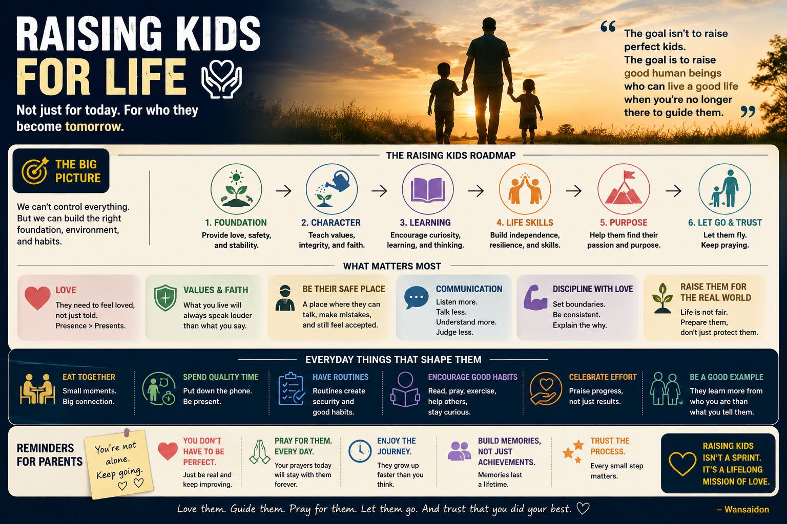

# 👨‍👩‍👧‍👦 Raising Kids for Life, Not Just Grades

> **PSLE. O-Level. Diploma. Degree. Good job. Good salary.**
>
> We prepare kids for the next step.
>
> **But are we preparing them for life?**

I'm not a parenting expert.

Just one simple thought:

> ## **Don't only prepare kids to succeed. Prepare them to handle life.**

---

---

## 🎓 Grades Matter — But Life Got No Model Answer

Of course kids should study.

But growing up today also means dealing with:

**Pressure. FOMO. Friendship problems. Failure. Social media.**

Open social media...

Someone got better results.

Someone went holiday.

Someone got something new.

Then start thinking:

> **"Wah, how come everybody doing better than me?"**

But what we see online isn't someone's whole life.

Study hard.

Do your best.

But don't forget to live also.

> **Childhood got no replay button.** 😂

---

## ❤️ Sometimes "I'm Okay" Doesn't Mean Okay

Don't only ask:

> **"How many marks you get?"**

Sometimes ask:

> **"You okay or not?"**

Then really listen.

School got pressure.

Friends got pressure.

Social media also got pressure.

Come home already...

> **Don't add more pressure lah.**

Sometimes they don't need another lecture.

**They just need Mum and Dad to listen.**

---

## 🌱 Let Them Learn to Handle Life

Don't solve every small problem for them.

Let them try.

Let them lose sometimes.

Let them make mistakes and learn.

And when they really need you:

**Be there.**

> **Because Mum and Dad cannot cannot be there forever.** 😂

Give them support.

But also give them room to grow.

---

## 🙏 Give Them Something to Hold On To

Sometimes you can study hard, work hard and do your best...

and things still don't go your way.

That's where I believe faith matters.

**Do your best.**

**Ask for help.**

**Try again.**

**Trust God with what you cannot control.**

> **Faith doesn't remove every problem. It gives you something to hold on to while facing it.**

---

# 🧭 The Simple Idea

Give them:

**🎓 Education** — Learn.

**❤️ Values** — Be a good person.

**🌱 Resilience** — Learn to get back up.

**🏠 Home** — Know Mum and Dad are there.

**🙏 Faith** — Have something to hold on to.

> ## **Don't only prepare your kids for success. Prepare them for life.**

---

## 🐍 Python Version

[View `strongkids.py`](strongkids.py)

---

## ⚠️ Disclaimer

A personal reflection on raising kids and preparing them for life.

---

## ✍️ Credits

**Concept & direction:** Wansaidon  
**Written with:** ChatGPT by OpenAI

---

> **One day we can't solve every problem for them.**

***So teach them how to face life — and remind them they don't have to face it alone.***